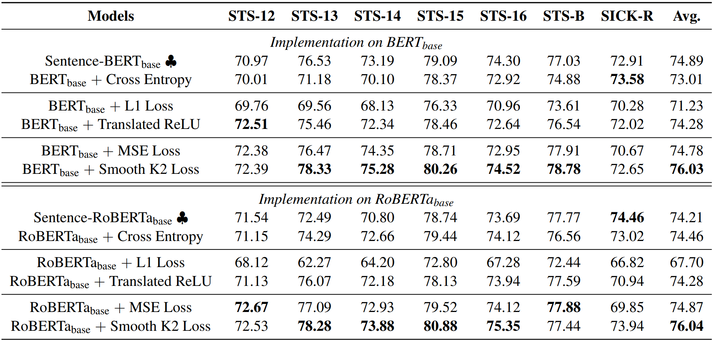
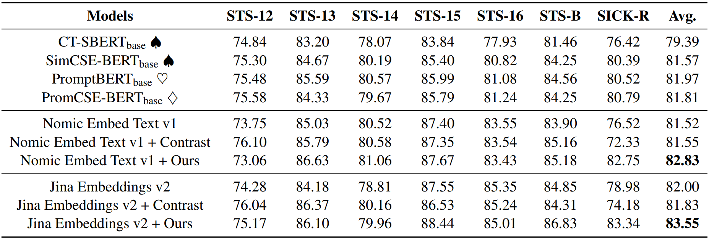

# Read Me

[Advancing Semantic Textual Similarity Modeling: A Regression Framework with Translated ReLU and Smooth K2 Loss](https://arxiv.org/abs/2406.05326)

__This paper has been accepted to EMNLP 2024. (Main)__

***

## Results

- `NLI Dataset + BERT-base / RoBERTa-base`

  

- `NLI Dataset + Filtered STS-B and SICK-R training sets + Jina v2 / Nomic v1`

  

***

## Data

- NLI Dataset: `nli_012.csv`
- Filtered STS-B and SICK-R training sets: `merged-SICK-STS-B-train.jsonl`
- Link: https://drive.google.com/drive/folders/1pZmJgMezL2CeBjPVxx2-6V9vfSnAuVIk?usp=sharing

## Checkpoints

- Link: https://drive.google.com/drive/folders/1-te5DByiDpcKd-AxZPmCEgkRqnaTvzmk?usp=sharing

  ```python
  tlu: Translated ReLU
  sk2: Smooth K2 Loss
  ```

## Quick Start

- Python Version: 3.9.16

- Install Dependencies

  ```bash
  cd code
  pip install -r requirements.txt
  ```

- Download SentEval

  ```bash
  cd SentEval/data/downstream/
  bash download_dataset.sh
  cd -
  cd ./data
  bash download_nli.sh
  cd -
  ```

- Training and Tuning

  ```bash
  nohup torchrun --nproc_per_node=4 train-bert-roberta.py > nohup.out & # 4090 * 4
  nohup torchrun --nproc_per_node=2 train-jina-nomic.py > nohup.out & # A6000 * 2
  nohup torchrun --nproc_per_node=2 tune-jina-nomic.py > nohup.out & # A6000 * 2
  ```

## Friendship Link

- Github: [Pcc-tuning](https://github.com/ZBWpro/Pcc-tuning)

  Paper: [Pcc-tuning: Breaking the Contrastive Learning Ceiling in Semantic Textual Similarity](https://arxiv.org/abs/2406.09790)

  Conference: :star2: EMNLP 2024, **Main**

- Github: [CoT-BERT](https://github.com/ZBWpro/CoT-BERT)

  Paper: [CoT-BERT: Enhancing Unsupervised Sentence Representation through Chain-of-Thought](https://arxiv.org/abs/2309.11143) 

  Conference::star2: ICANN 2024, **Oral**

- Github: [PretCoTandKE](https://github.com/ZBWpro/PretCoTandKE)

  Paper: [Simple Techniques for Enhancing Sentence Embeddings in Generative Language Models](https://arxiv.org/abs/2404.03921)​ 

  Conference::star2: ICIC 2024, **Oral**
